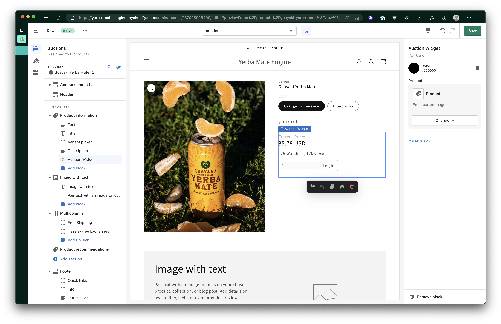
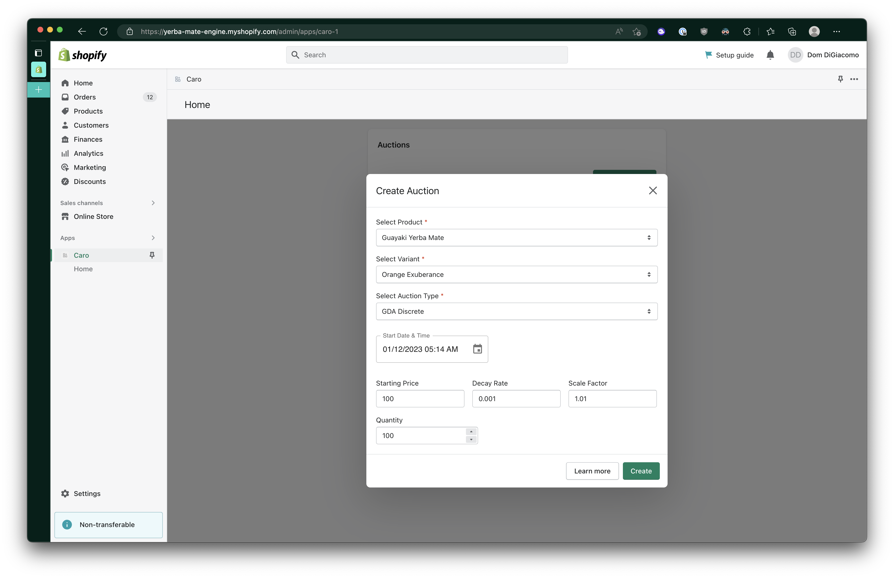

# Setup

## Installation
A custom Shopify Plugin installation link will be shared.

## Configure Product Auction

### Create a Product Page Template for Auctions
#### Click on `Online Store`
#### Click on `Customize`

#### Click on `Home Page` Dropdown
#### Click on `Products`

#### Click on `Create template`

#### Give _Name_ as `Product Auctions`
#### Click on `Create template` Button

#### Click on `Add block`
#### Click on `Auction Widget`

### Specify Product to Page Template
#### Navigate back to _Products Inventory_ Page

#### Select _Auctioning_ Product
##### Set `Theme template` to `product-auctions`

#### Navigate to Caro Home

### Setup Caro Auction for *Product*
TODO: insert details about auction parameters

## View Product Auction
#### Navigate to *Product* Page

